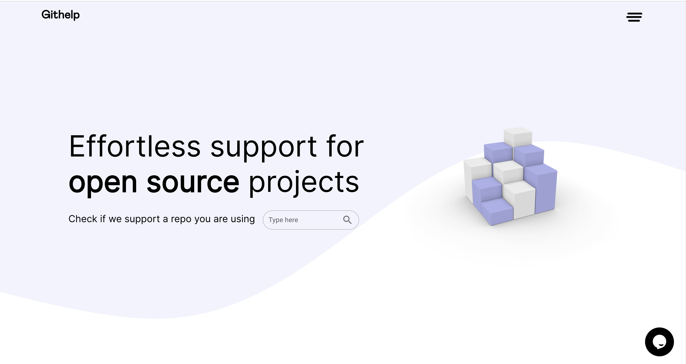

# Githelp Support for [Your Open Source Project]

## What is Githelp?

[Githelp](https://githelp.app/) is a support service platform initiated to improve support and accelerate growth for
open source projects. It will offer support infrastructure that includes scheduling, payments, and reviews, all 
seamlessly integrated with Discord.

    

## Our vision

Make open source prosjects competitve options to commercial cloud-based SaaS, by giving them a custom platform for providing
professional support and receiving financial kickback from the support provided. We believe this will contribute in making it 
easier for companies and organisations to put their faith in open source code, as the support system and help functions will 
feel more solid and reliable planning for long-term operations. 

## What We Offer

### For open source projects
- **Support put in system:** Easily schedule, receive payments, and gather reviews for your open source project.
- **Community Focus:** We believe in the growth of open source. Earn a kickback for the support performed with your
  repo. Encourage your repo members to join the platform and get compensated for their support efforts.
- **Monthly Support Statistics:** Gain insights into user interactions with your service. Concentrate your
   development efforts where it matters most by understanding how users are utilizing your support and where they may be
   encountering challenges.

### For developers in need of support 
- **Effortless Support:** Easily schedule, pay, and get help on the open source projects you are using.
- **Sponsor while getting help:** It can be difficult to ask your employer to sponsor a repository you are using through donations.
  With Githelp you support the open source projcts you like, while also getting help with the issues you encounter. As every repo earn
  a kickback for the support performed with their project.
- **More reliable support:** Don´t wait for your questions to be picked up in Discord support channels or at forums. Get help instantly. 
  

### For developers helping with support 
- **Get Compensated:** There are multiple ways to provide support today without getting paid for it. However, our resarch show that most
  developers would prefer to be compensated, and would be willing to spend more time on support if there was a compensation in place.
- **Community Focus:** Help out the open source projects you like and give back to community, in a more sustainable way, where
  your efforts are being compensated. 
- **Clear and Transparent tickets:** Details about help wanted easily summarised in a concrete and structured way. 

## Get Started in Minutes

**Create Your Repo Support Page:** Register your repo and create a customized support page in minutes by sending us a message. 
Provide users with information on how to get help, pricing details, and the ability to create support tickets.

## How It Works

1. **Create a Ticket:**
    - Share some information about your issue.
    - Shouldn't take more than 1-5 minutes.

2. **Sip Some Coffee:**
    - Submit information and wait for help.
    - Get help instantly or schedule it for later.

3. **Get Help:**
    - Choose your preferred way to receive support—chat, voice, or video.

## Getting Started with Githelp

To integrate Githelp support into your open source project, follow these steps:

1. Sign up on [Githelp](https://githelp.app/) and register your repository by sending us a message.
2. Customize your repo support page to provide users with all the necessary information.
3. Encourage your repo members to join Githelp to make their support efforts compensated.

## Support and Contact

For any questions or assistance, feel free to contact our support team at [hello@githelp.app](mailto:hello@githelp.app).

or drop by our [Discord](https://discord.gg/MN6zX6xQ)

Don't forget to leave a star ⭐️.

[//]: # (TODO: Add a link to the terms of use and privacy policy)

[Terms of Use](./terms_of_use.md) | [Privacy Policy](./privacy_policy.md)

